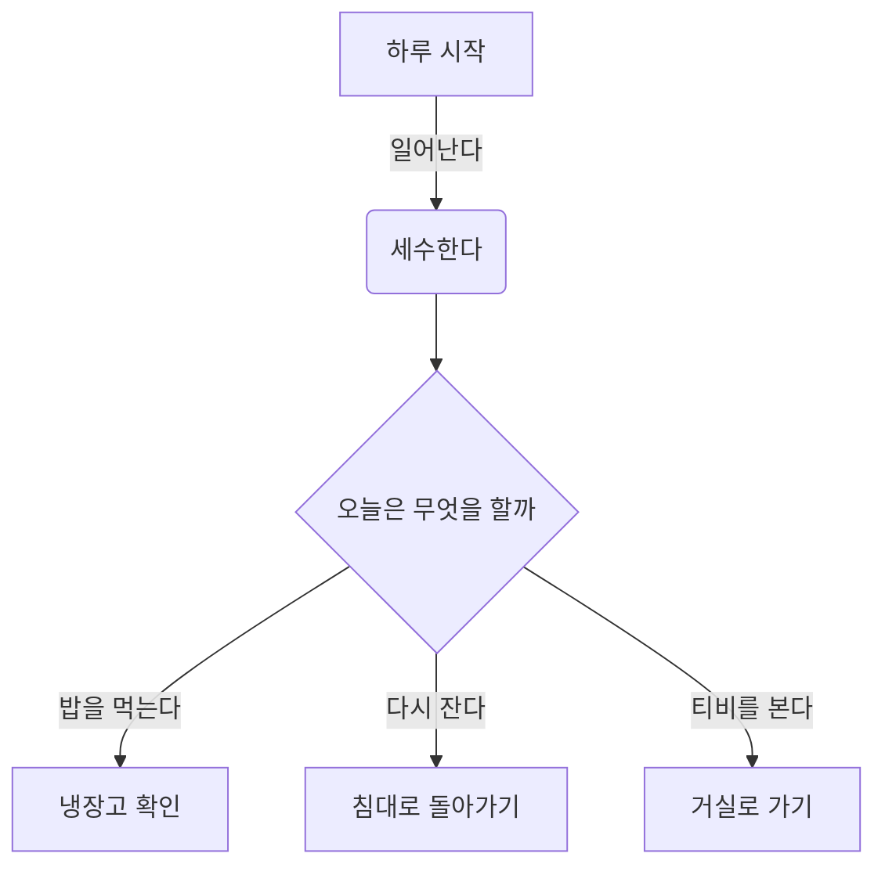
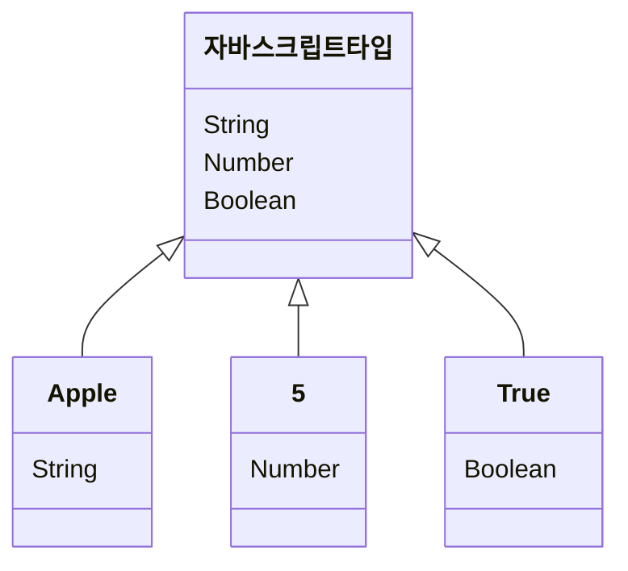

# Mermaid
이전엔 표, 차트, 다이어그램등을 그릴 때  유료 도구인 [Visio](https://www.microsoft.com/ko-kr/microsoft-365/visio/flowchart-software)나  파워포인트로 직접 그려 이미지를 추가했다면, 최근 깃에서 지원하는 머메이드라는 도구를 활용해 차트를 더욱 쉽고 빠르게 코드로 작성할 수 있게 되었습니다. 

머메이드는 텍스트와 코드를 통해 **다이어그램 또는 차트와 같이 데이터를 시각화** 할 수 있도록 도와주는, **자바스크립트 기반의 도구**입니다. 서비스 개발 시 필요한 데이터, 서비스의 구조나 흐름을 작성할때 사용할 수 있습니다.  

머메이드는 고유의 문법을 사용하는 데요, 마크다운을 이미 알고 있다면, 그리고 [**공식 가이드**](https://mermaid-js.github.io/mermaid/#/)를 참고 한다면 금방 배울 수 있습니다.

### Flow Chart

### ClassDiagram

